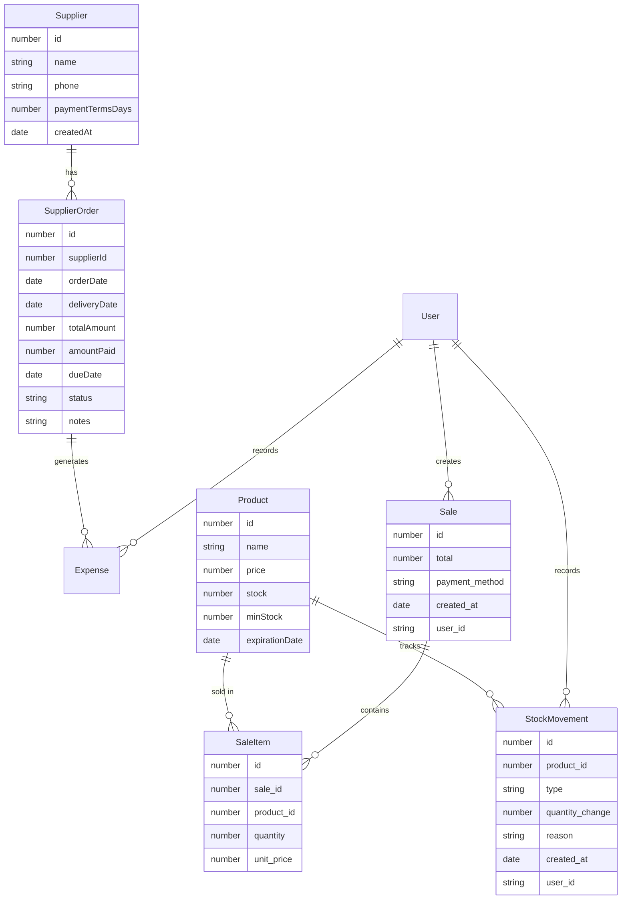
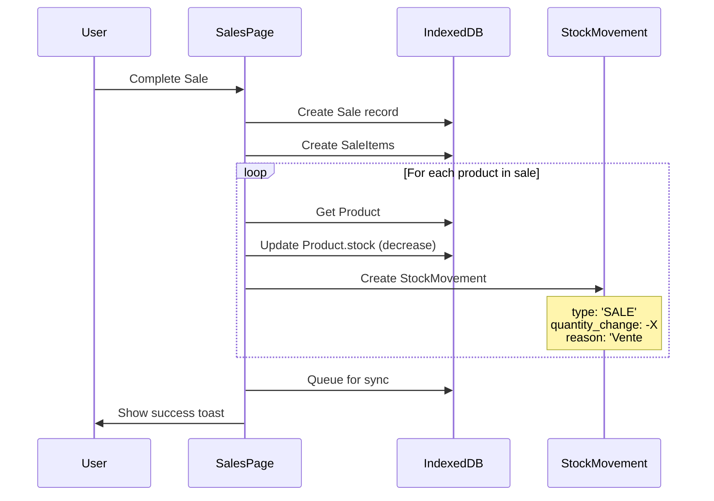
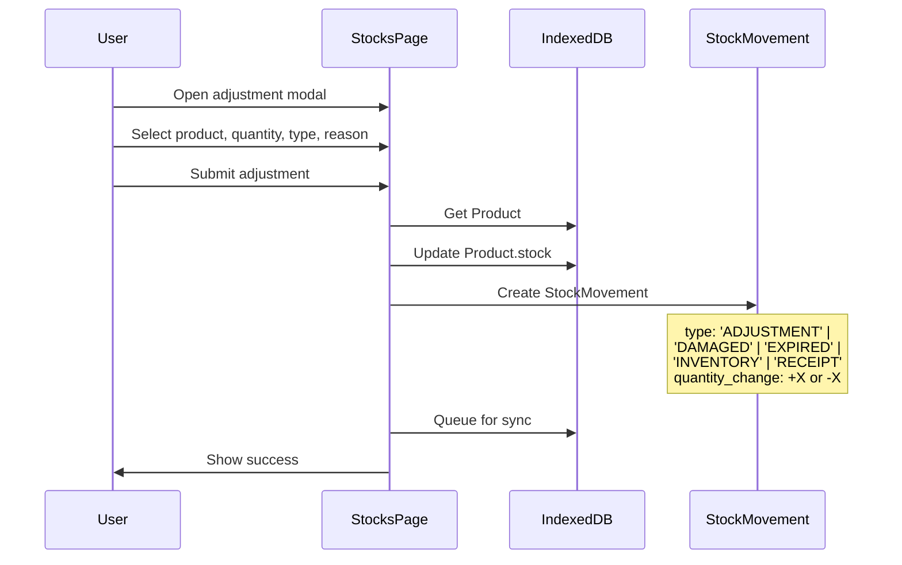
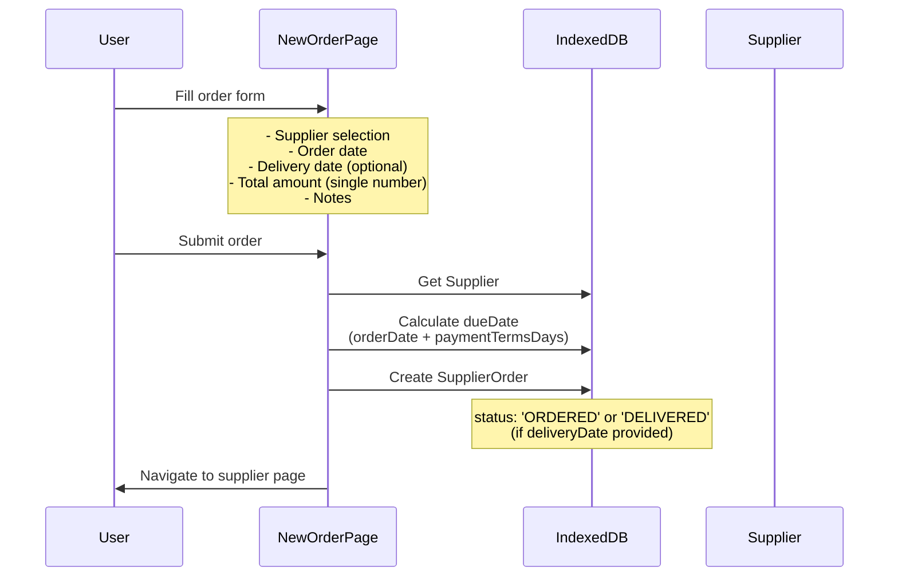
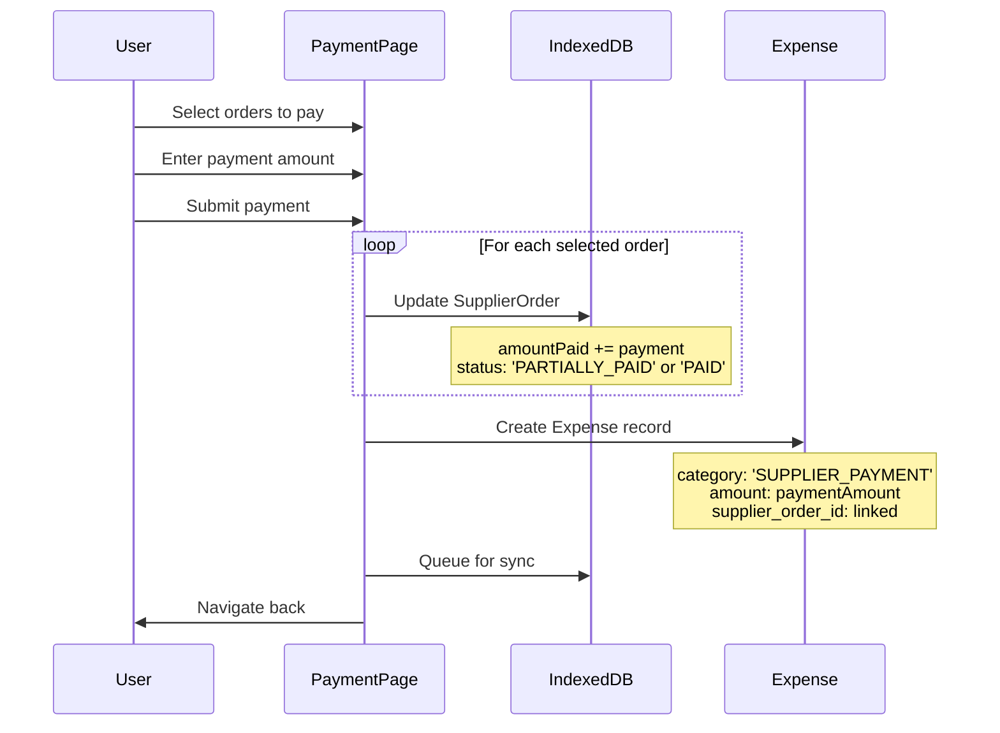
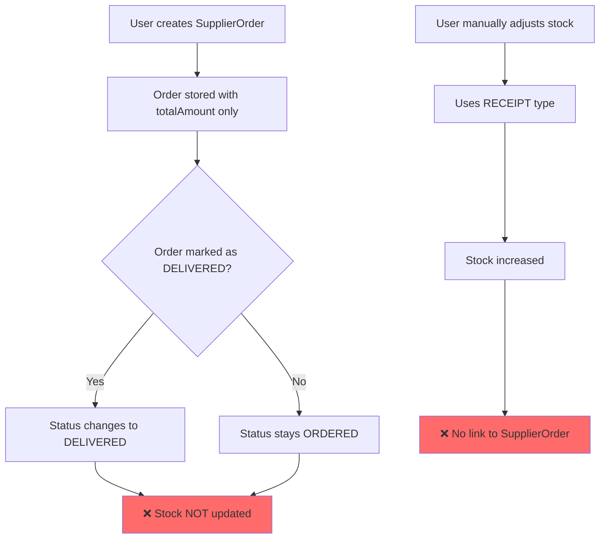
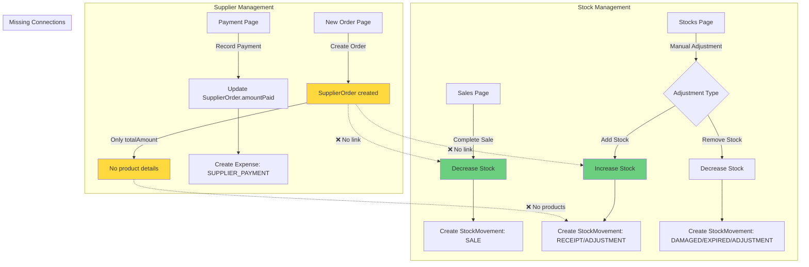

# Current State: Stock & Supplier Management

## Overview

This document explains what currently exists in the stock and supplier management system, with visual diagrams showing data flows and relationships.

---

## 1. Data Model Relationships



**Key Observations:**
- ✅ `SupplierOrder` exists but has NO relationship to `Product` or `StockMovement`
- ✅ `StockMovement` tracks stock changes but has NO link to `SupplierOrder`
- ❌ **Missing**: `SupplierOrderItem` table (orders don't have product breakdown)

---

## 2. Stock Management Flow (Current)

### 2.1 Stock Decreases (Sales)



**What happens:**
1. User completes a sale
2. For each product sold:
   - Product stock is decreased
   - StockMovement record created with type `SALE`
3. Changes queued for server sync

### 2.2 Stock Adjustments (Manual)



**Available adjustment types:**
- `ADJUSTMENT` - General correction
- `INVENTORY` - Physical count
- `RECEIPT` - Received from supplier (manual)
- `DAMAGED` - Product damaged
- `EXPIRED` - Product expired

**Current limitation:** When using `RECEIPT`, there's NO automatic link to a `SupplierOrder`.

---

## 3. Supplier Order Flow (Current)

### 3.1 Order Creation



**Current limitations:**
- ❌ No product selection - only total amount
- ❌ No line items - can't specify which products were ordered
- ❌ No automatic stock update when `deliveryDate` is set

### 3.2 Order Payment



**What works:**
- ✅ Multiple orders can be paid in one transaction
- ✅ Payment distributed oldest-first
- ✅ Expense automatically created
- ✅ Order status updated correctly

---

## 4. The Disconnect: Orders ↔ Stock

### Current Problem



**The Gap:**
1. **Orders don't specify products** - Only a total amount, no line items
2. **Delivery doesn't update stock** - Even if `deliveryDate` is set, stock remains unchanged
3. **Manual stock increases aren't linked** - When using `RECEIPT` adjustment, there's no way to link it to the order

---

## 5. Complete Current Flow Diagram



---

## 6. Current Pages & Features

### 6.1 Stock Management Pages

| Page | Location | Features |
|------|----------|----------|
| **Stocks List** | `/stocks` | View products, search, filter by category/alerts, adjust stock manually |
| **Stock Adjustment** | Modal in `/stocks` | Add/remove stock with reason, supports: ADJUSTMENT, INVENTORY, RECEIPT, DAMAGED, EXPIRED |

### 6.2 Supplier Management Pages

| Page | Location | Features |
|------|----------|----------|
| **Suppliers List** | `/fournisseurs` | View all suppliers, filter by payment status, see balances |
| **Supplier Detail** | `/fournisseurs/[id]` | View supplier info, orders list, quick actions (new order, payment, return) |
| **New Supplier** | `/fournisseurs/nouveau` | Create supplier with name, phone, payment terms |
| **New Order** | `/fournisseurs/commande/nouvelle` | Create order (supplier, dates, total amount, notes) |
| **Payment** | `/fournisseurs/paiement` | Record payment for one or multiple orders |

### 6.3 Missing Pages

- ❌ **Order Detail/Edit** - No page to view/edit order details
- ❌ **Order Items** - No way to see what products are in an order

---

## 7. Database Schema (Current)

### IndexedDB Tables

```typescript
// ✅ EXISTS
suppliers: {
  id, serverId, name, phone, paymentTermsDays, 
  createdAt, updatedAt, synced
}

supplier_orders: {
  id, serverId, supplierId, orderDate, deliveryDate,
  totalAmount, amountPaid, dueDate, status, notes,
  createdAt, updatedAt, synced
}

products: {
  id, serverId, name, category, price, priceBuy,
  stock, minStock, expirationDate, lotNumber,
  synced, updatedAt
}

stock_movements: {
  id, serverId, product_id, type, quantity_change,
  reason, created_at, user_id, synced
}

// ❌ MISSING
supplier_order_items: {
  // This table doesn't exist!
  // Should have: id, order_id, product_id, quantity, unit_price
}
```

---

## 8. Summary: What Works vs What's Missing

### ✅ What Works

1. **Stock Decreases from Sales**
   - Automatic stock reduction when sales complete
   - StockMovement audit trail

2. **Manual Stock Adjustments**
   - Add/remove stock with reasons
   - Multiple movement types (DAMAGED, EXPIRED, etc.)

3. **Supplier & Order Management**
   - Create suppliers with payment terms
   - Create orders with dates and amounts
   - Track payments (partial and full)
   - Payment reminders and due date tracking

4. **Offline-First Architecture**
   - All data stored in IndexedDB
   - Sync queue for server updates

### ❌ What's Missing

1. **Order → Stock Connection**
   - Orders don't specify which products were ordered
   - Delivery doesn't automatically increase stock
   - No way to link stock increases to orders

2. **Order Management**
   - Can't edit orders after creation
   - No order detail page
   - No product breakdown in orders

3. **UX Consistency**
   - Supplier pages use different visual style than sales/dashboard
   - Missing some design system elements

---

## Next Steps

The plan will address:
1. Adding `SupplierOrderItem` table for product breakdown
2. Creating order detail/edit page
3. Implementing delivery confirmation that updates stock
4. Improving UX consistency across all pages

